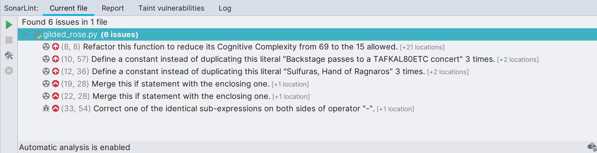
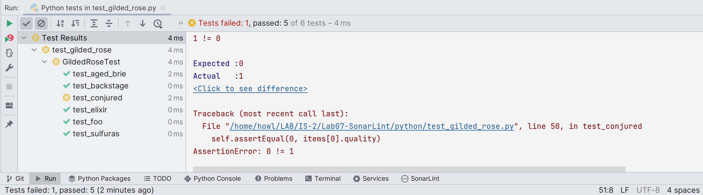

## Laboratorio 7: Refactoring y SonarLint
<hr>

# Informe de Refactoring

**Objetivo:** Mejorar el entendimiento, la extensibilidad y reutilización de un proyecto de software (Clean Code)

## 1. Identificación de *Code Smells*

Con la ayuda de la extensión SonarLint, se pudó identificar los siguientes 
*code smells* :



Las reglas que se imcumplieron fueron las siguientes:

* La complejidad cognitiva de las funciones no debe ser demasiado alta. 
* Los *strings* literales no deben duplicarse. 
* Las declaraciones *if* plegables deben fusionarse. 
* No se deben usar expresiones idénticas en ambos lados de un operador binario.

## 2. Adición de casos de prueba faltantes para la nueva funcionalidad (TDD)
Antes de añadir la nueva funcionalidad se desarrollaron dos tipos de pruebas
dentro del archivo [test_glided_rose.py](./python/test_gilded_rose.py):
- Pruebas para comprobar que el código antes y después de la refactorización funcione correctamente. Esto servirá para el siguiente paso de refactorización.

```
    def test_foo(self):
        items = [Item("foo", 0, 1)]
        gilded_rose = GildedRose(items)
        gilded_rose.update_quality()
        self.assertEqual(-1, items[0].sell_in)
        self.assertEqual(0, items[0].quality)

    def test_elixir(self):
        items = [Item("Elixir of the Mongoose", 5, 7)]
        gilded_rose = GildedRose(items)
        gilded_rose.update_quality()
        self.assertEqual(4, items[0].sell_in)
        self.assertEqual(6, items[0].quality)
    
    def test_aged_brie(self):
        items = [Item("Aged Brie", 2, 0)]
        gilded_rose = GildedRose(items)
        gilded_rose.update_quality()
        self.assertEqual(1, items[0].sell_in)
        self.assertEqual(1, items[0].quality)

    def test_sulfuras(self):
        items = [Item("Sulfuras, Hand of Ragnaros", 0, 80)]
        gilded_rose = GildedRose(items)
        gilded_rose.update_quality()
        self.assertEqual(0, items[0].sell_in)
        self.assertEqual(80, items[0].quality)

    def test_backstage(self):
        items = [Item("Backstage passes to a TAFKAL80ETC concert", 10, 40)]
        gilded_rose = GildedRose(items)
        gilded_rose.update_quality()
        self.assertEqual(9, items[0].sell_in)
        self.assertEqual(42, items[0].quality)
```

- Pruebas para comprobar que la adición de la nueva funcionalidad para los **artículos conjurados** 
 funcionen como se espera.
 
  - Valores de entrada: "Conjured Mana Cake", 6, 2
  - Valor esperado al usar update_quality(): quality = 0, sell_in = 5 
 
```
    def test_conjured(self):
        items = [Item("Conjured Mana Cake", 6, 2)] 
        gilded_rose = GildedRose(items)
        gilded_rose.update_quality()
        self.assertEqual(5, items[0].sell_in)
        self.assertEqual(0, items[0].quality)
```

Al correr las pruebas, como aún no se implementó la funcionalidad nueva
se esperaba que el test de esta funcionalidad no pasara



## 3. Refactorización del código
Una vez comprobadó el funcionamiento correcto del código 

## 4. Implementación de la nueva funcionalidad


## 5. Verificación y validación de las actualizaciones 
Para esta tarea se volvió a usar **SonarLint** y se obtuvo el siguiente resultado:


Se puede observar que el código de esta vez no se detectó ninguna violación de reglas ni *issues*.

Por otro lado, también se re-ejecutarón las Pruebas para verificar que el código funcione
correctamente:

